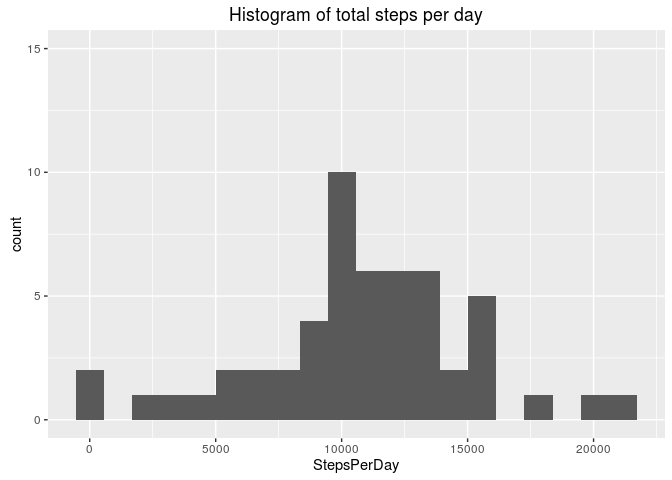
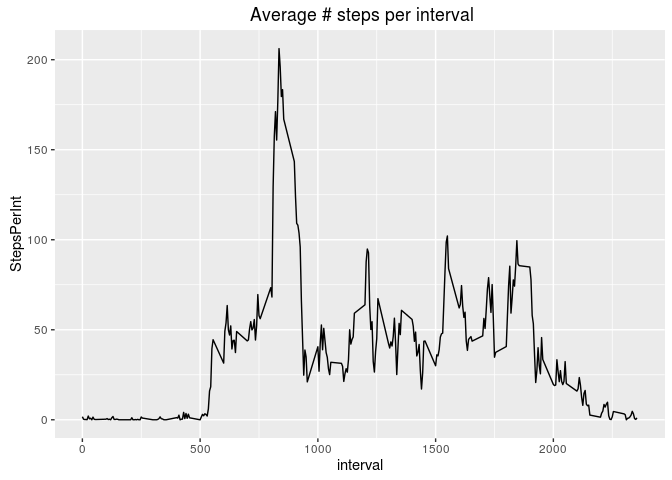
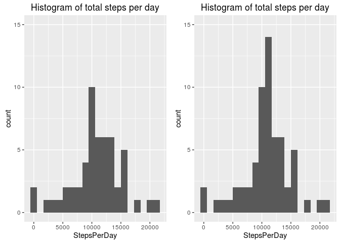
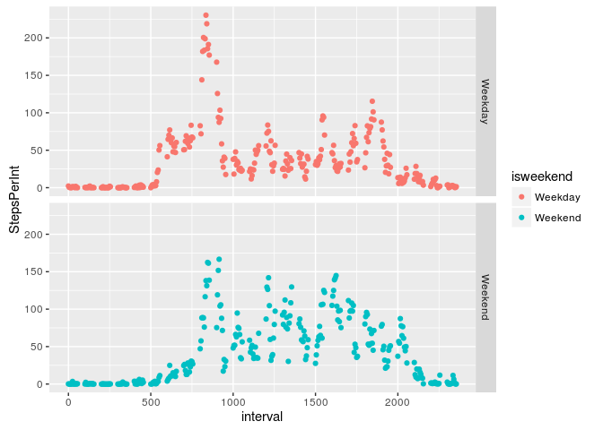

# Reproducible Research: Peer Assessment 1


## Loading and preprocessing the data
Start with loading the necessary libraries:

```r
library(dplyr) # Great package to work with dfs
```

```
## 
## Attaching package: 'dplyr'
```

```
## The following objects are masked from 'package:stats':
## 
##     filter, lag
```

```
## The following objects are masked from 'package:base':
## 
##     intersect, setdiff, setequal, union
```

```r
library(tidyr) # ^^
library(ggplot2) # For plotting I just love ggplot2
library(lubridate) # For working with the dates
library(grid)
library(gridExtra)
```

```
## 
## Attaching package: 'gridExtra'
```

```
## The following object is masked from 'package:dplyr':
## 
##     combine
```

Read the CSV data into a dataframe, filter out the NAs, and group by the day

```r
activity_list <- tbl_df(read.csv("./activity.csv")) # Read the data into a dataframe
# Dataset grouped by date
activity_list_1 <- activity_list %>% filter(!is.na(steps)) %>%  # Filter the NAs
  group_by(date) %>% # Group by the date
  summarize(StepsPerDay = sum(steps)) # Sum of the steps elements in each group
```
Group the dataset by the interval


```r
activity_list_2 <- activity_list %>% filter(!is.na(steps)) %>%  # Filter the NAs
  group_by(interval) %>% # Group by the interval
  summarize(StepsPerInt = mean(steps)) # Sum of the steps elements in each group
```

## What is mean total number of steps taken per day?
Here I show the histogram of the total number of steps taken per day (using ggplot2):

```r
p1 <- qplot(StepsPerDay,data = activity_list_1,geom = "histogram",bins = 20,main="Histogram of total steps per day") + ylim(0,15)
print(p1)
```



```r
# Prepare the mean-median data:
Mean_Median <-as.data.frame(t(c(mean(activity_list_1$StepsPerDay),median(activity_list_1$StepsPerDay))))
colnames(Mean_Median) <- c("Mean of steps per day","Median of steps per day")
```

and finally the mean-median values of the total numbers of steps taken per day:


```r
print(Mean_Median)
```

```
##   Mean of steps per day Median of steps per day
## 1              10766.19                   10765
```

## What is the average daily activity pattern?
The plot indicating the average number of steps per interval:


```r
p2 <- qplot(interval,StepsPerInt,data = activity_list_2,geom="line",main=" Average # steps per interval")
print(p2)
```



The interval with the max steps per interval, and the value:


```r
interval_max_steps <- slice(activity_list_2,which.max(activity_list_2$StepsPerInt))
print(interval_max_steps)
```

```
## Source: local data frame [1 x 2]
## 
##   interval StepsPerInt
##      (int)       (dbl)
## 1      835    206.1698
```

## Imputing missing values
I will impute the missing values with their averages per the corresponding interval, using the following function:


```r
# Function to do imputation
imputeNA <- function(steps,interval,Int_averages)
{ # If Steps has NA -> replace with a mean for that interval
for (i in 1:length(steps))
{
  step = steps[i]
  if (is.na(step)){
    steps[i] = Int_averages$StepsPerInt[Int_averages$interval ==interval[i]]
  } 
}
  steps
}
```

Here's the code showing how the imputation of the dataset is done:

```r
activity_list_3 <- activity_list %>% mutate(steps = imputeNA(steps,interval,activity_list_2))
grouped_imputed  <- activity_list_3 %>% 
  group_by(date) %>% # Group by the date
  summarize(StepsPerDay = sum(steps)) # Sum of the steps elements in each group
```

Finally, show the two histograms that are somewhat similar to each other (with max values slightly shifting to another interval and spiking up due to imputation?):

```r
p3 <- qplot(StepsPerDay,data = grouped_imputed,geom = "histogram",bins = 20,main="Histogram of total steps per day") + ylim(0,15)
 # Show the histograms before and after the imputing values
grid.arrange(p1,p3,ncol=2)
```



The mean and median values after the imputation has become identical (no surprise, though):


```r
Mean_Median_Im <-as.data.frame(t(c(mean(grouped_imputed$StepsPerDay),median(grouped_imputed$StepsPerDay))))
colnames(Mean_Median_Im) <- c("(Imputed) Mean of steps per day","Median of steps per day")
print(Mean_Median_Im)
```

```
##   (Imputed) Mean of steps per day Median of steps per day
## 1                        10766.19                10766.19
```

## Are there differences in activity patterns between weekdays and weekends?
Now use the imputed dataset to analyze the changes in the activity pattern between weekdays and weekends.
Make an isweekend function:
 

```r
is.weekend <- function(x)
{
  if (x %in% c("Sat","Sun"))
  {
    y = "Weekend"
  }
  else {y = "Weekday"}
}
```
 Augment the imputed dataset with the is-week-end flags.


```r
grouped_by_weekday <- activity_list_3 %>% mutate(isweekend = as.factor(sapply(wday(date,label=TRUE),is.weekend))) %>% group_by(interval,isweekend) %>% summarize(StepsPerInt = mean(steps)) 
```
 Finally, plot the two-faceted graph showing the change in the activity pattern over the weekend-weekday:
 

```r
p4 <- qplot(interval,StepsPerInt,data = grouped_by_weekday,facets = isweekend~.,colour = isweekend)
print(p4)
```




